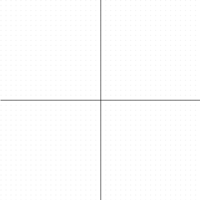
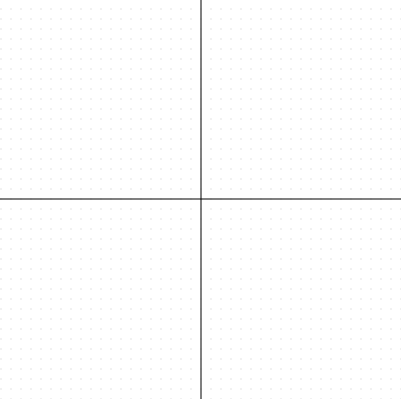

# GJK Collision Detection Demos

In trying to learn and implement my own GJK collision detection, I found it necessary to create some actual code and visualize the results. The efforts of which are recorded here.

This project draws to some canvases and can be demoed here: http://FuzzyWuzzie.github.io/gjk-demos/

Or just previewed as gifs:

